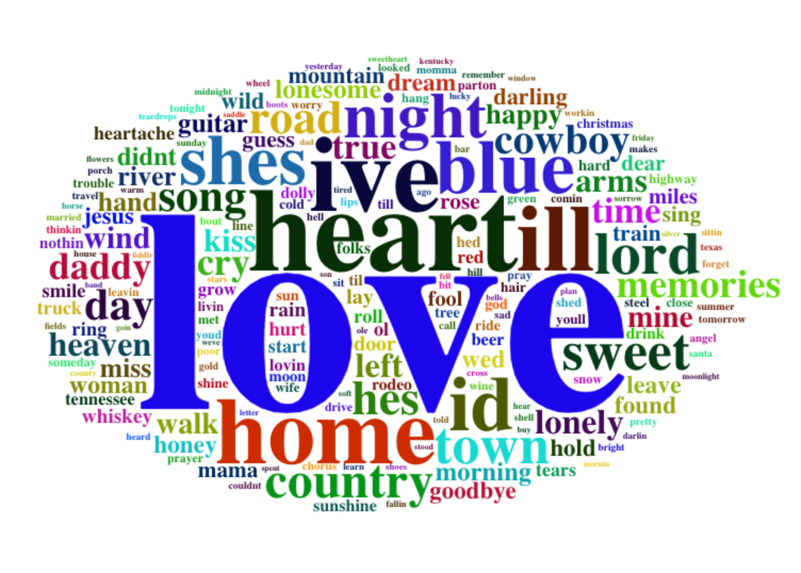
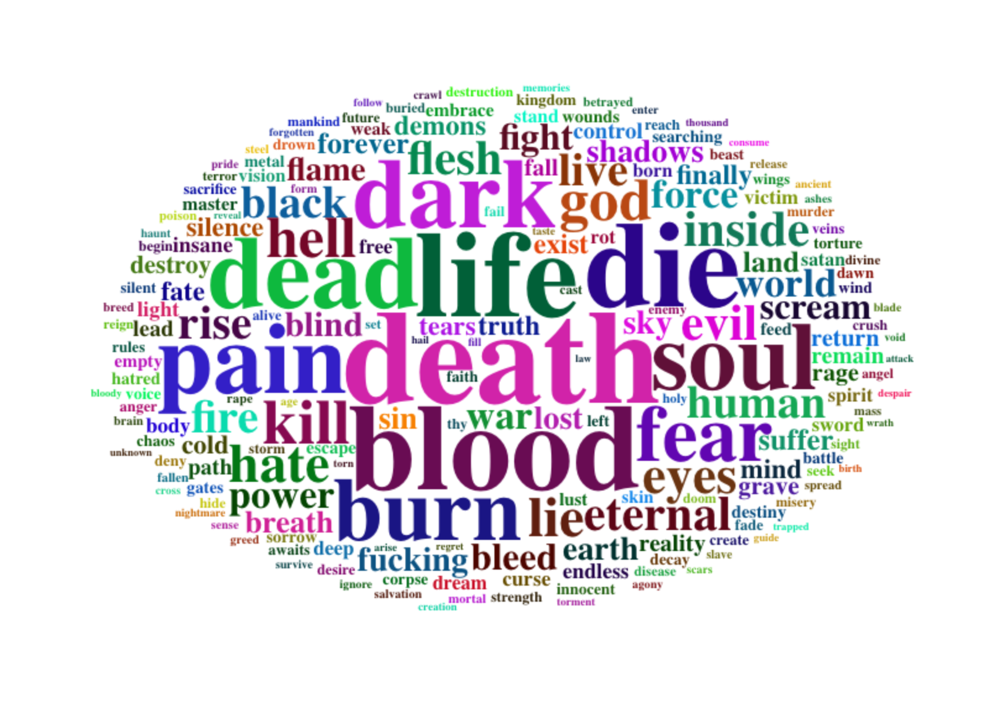

```{r include = FALSE}
packages.used=c("rvest", "tibble", "tidyverse", "tidytext", "frequency", "wordcloud2",
                "sentimentr", "gplots", "dplyr",
                "tm", "syuzhet", "factoextra", 
                "beeswarm", "scales", "RColorBrewer",
                "RANN", "topicmodels", "stringr", "fmsb", "radarchart")
# check packages that need to be installed.
packages.needed=setdiff(packages.used, 
                        intersect(installed.packages()[,1], 
                                  packages.used))
# install additional packages
if(length(packages.needed)>0){
  install.packages(packages.needed, dependencies = TRUE)
}
# load packages
library("sentimentr")
library("syuzhet")
library("tibble")
library("rvest")
library("wordcloud2")
library("tibble")
library("syuzhet")
library("sentimentr")
library("gplots")
library("dplyr")
library("tm")
library("syuzhet")
library("factoextra")
library("beeswarm")
library("scales")
library("RColorBrewer")
library("RANN")
library("tidyverse")
library("tidytext")
library("tm")
library("topicmodels")
library("stringr")
library("frequency")
library("fmsb")
library("radarchart")
load('../output/processed_lyrics.RData') 
# source("../lib/plotstacked.R")
# source("../lib/speechFuncs.R")

```
This notebook was prepared with the following environmental settings.
```{r}
print(R.version)
```
# Introduction: 

I grew up on Long Island, an hour east of here. My parents grew up on Long Island too, and although they love folk singers from their youth like Neil Young and Bob Dylan, none of us have ever cared for the country music you'd hear on the radio nowadays. In my view, it's because country songs are all about one of three things: livin' right, drinking after a breakup, or unrequited love. And that repetition gets boring!

However, we're all data scientists, and I know that letting an assumption like this stand without evidence would be a mistake. So, I set out to determine whether the sentiments in country music *are* actually the same more of the time than for other genres. 

## Step One: Cleaning the lyrics data

To clean the lyrics data provided, I used the provided Text_Processing.Rmd app.

## Step Two: Major sentiments of different genres

To start, I've created an overview of the sentiments of different genres via word cloud. However, these aren't typical word clouds: I started by taking data for all the lyrics in the data set together. Then, to generate the word cloud for each genre, I focused on the words that differ the most from this generic word cloud. This made a series of word clouds that more accurately explain the *differences* between the genres.

### Preparations for visualization
The lyric word counts are made into proportions. Then the average proportions are subtracted, leaving the words most overrepresented in a given genre. 
```{r echo=FALSE}
lyrics_list <- c("Folk", "R&B", "Electronic", "Jazz", "Indie", "Country", "Rock", "Metal", "Pop", "Hip-Hop", "Other")
#Get frequency list of all words
corpus <- VCorpus(VectorSource(dt_lyrics$stemmedwords))
word_tibble <- tidy(corpus) %>%
  select(text) %>%
  mutate(id = row_number()) %>%
  unnest_tokens(word, text)

#Generate counts for overall, and figure out percentage of each word of total
tibble_count <- count(word_tibble, word, sort=TRUE)
tibble_count$percent <- prop.table(tibble_count$n)

#Generate counts for each genre, and figure out percentage of each word of total
for (genreVar in lyrics_list){
  temp_count <- count(filter(word_tibble, id %in% which(dt_lyrics$genre == genreVar)), word, sort = TRUE)
  temp_count$percent <- prop.table(temp_count$n)
  genreVar <- str_replace_all(genreVar, "[&-]", "")
  nam <- paste(genreVar, "count", sep="_")
  assign(nam, temp_count)
}


```
### Displaying Word Clouds

Here's the word cloud for all genres. Notice how love is the biggest word, but it's balanced out by "time," "your," and "baby," to name a few. 

```{r echo=FALSE}
count(word_tibble, word, sort = TRUE) %>%
      slice(1:200) %>%
      wordcloud2(size=.8, rotateRatio=0)
```
Now, here's the word cloud for the words overrepresented in country music compared to the average song. You'll notice "love" is more dominant, along with "heart." We can also make out words we generally associate with country music, like "lord," "cowboy," "daddy," and "guitar." 

```{r echo=FALSE}
#Commented out because Word Clouds aren't rendering
# #print Country word cloud
# merged_table <- within(merge(tibble_count,Country_count,by="word"), {
#   n <- 0
#   percent <- percent.y - percent.x
#   })[,c("word","n","percent")]
# 
# merged_table <- select(merged_table, -2)
# merged_table <- merged_table[order(merged_table$percent, decreasing=TRUE),] %>%
#       slice(1:200)
# wordcloud2(data=merged_table, size=1.5, rotateRatio=0)

```
Finally, here's what the word cloud of words overrepresented in metal songs looks like. I don't think I have to interpret this one for you. 


```{r echo=FALSE}
#Commented out because Word Clouds aren't rendering
# merged_table <- within(merge(tibble_count,Metal_count,by="word"), {
#   n <- 0
#   percent <- percent.y - percent.x
#   })[,c("word","n","percent")]
# 
# merged_table <- select(merged_table, -2)
# merged_table <- merged_table[order(merged_table$percent, decreasing=TRUE),] %>%
#       slice(1:200)
# wordcloud2(data=merged_table, size=0.6, rotateRatio=0)
```


As you can see, the word cloud for country music mostly resembles other genreswhile the word cloud for metal music has much different language. This is our first hint that country music doesn't differ much from the other genres. But what about our original question: are all country songs the same?

## Within the country genre

Using a strategy similar to the above, let's look at the way country songs have changed over time. For each decade from the '70s to the '2010s, let's figure out which words are overrepresented compared to the average of all the country songs from each decade.

```{r echo=FALSE}
time_list <- c("1970s", "1980s", "1990s", "2000s", "2010s")

#Generate counts for each time period in country and figure out percentage of each word of total
for (timeVar in time_list){
  year_start <- as.integer(substr(timeVar, 1, 4))
  year_end <- (year_start+10)
  dt_sub1 <- filter(dt_lyrics, year>=year_start) %>%
    filter(year<(year_start+10))
  temp_count <- count(filter(word_tibble, id %in% which(dt_sub1$genre == "Country")), word, sort = TRUE)
  temp_count$percent <- prop.table(temp_count$n)
  nam <- paste("cc", timeVar, "country_count", sep="_")
  assign(nam, temp_count)
}

#Now, compare those to the Country_count generated in the last step
```
## 1970's Country Music Word Cloud

```{r echo=FALSE}
#print 1970's Country word cloud and chart
merged_table <- within(merge(Country_count,cc_1970s_country_count,by="word"), {
  n <- 0
  percent <- percent.y - percent.x
  })[,c("word","n","percent")]

merged_table <- select(merged_table, -2)
merged_table <- merged_table[order(merged_table$percent, decreasing=TRUE),] %>%
      slice(1:200)
wordcloud2(data=merged_table, size=0.6, rotateRatio=0)

head(merged_table,10)
```

## 1990's Country Music Word Cloud

```{r echo=FALSE}
#print 1990's Country word cloud and chart
merged_table <- within(merge(Country_count,cc_1990s_country_count,by="word"), {
  n <- 0
  percent <- percent.y - percent.x
  })[,c("word","n","percent")]

merged_table <- select(merged_table, -2)
merged_table <- merged_table[order(merged_table$percent, decreasing=TRUE),] %>%
      slice(1:200)
wordcloud2(data=merged_table, size=0.6, rotateRatio=0)

head(merged_table,10)
```

## 2010's Country Music Word Cloud

```{r echo=FALSE}
#print 2010's Country word cloud and chart
merged_table <- within(merge(Country_count,cc_2010s_country_count,by="word"), {
  n <- 0
  percent <- percent.y - percent.x
  })[,c("word","n","percent")]

merged_table <- select(merged_table, -2)
merged_table <- merged_table[order(merged_table$percent, decreasing=TRUE),] %>%
      slice(1:200)
wordcloud2(data=merged_table, size=0.4, rotateRatio=0)

head(merged_table,10)

```

There do seem to be some clear differences in the words that define each decade: the seventies with the earthen imagery, the 2010's with swears and references to the "beat." However, this isn't a clear enough picture. For that, let's try...

## Sentiment analysis 

Let's see if we can detect differences in the sentiments of the songs between the decades.

First up, an overall sentiment analysis of country songs. 

```{r echo=FALSE}

country_nrc_sub <-Country_count %>%
  inner_join(get_sentiments("nrc")) %>%
  filter(!sentiment %in% c("positive", "negative"))

nrc_plot <- country_nrc_sub %>%
  group_by(sentiment) %>%
  summarise(word_count = n()) %>%
  ungroup() %>%
  mutate(sentiment = reorder(sentiment, word_count)) %>%
  #Use `fill = -word_count` to make the larger bars darker
  ggplot(aes(sentiment, word_count, fill = -word_count)) +
  geom_col() +
  guides(fill = FALSE) + #Turn off the legend
  labs(x = NULL, y = "Word Count") +
  scale_y_continuous(limits = c(0, 1000)) + #Hard code the axis limit
  ggtitle("Country Music Total NRC Sentiment") +
  coord_flip()
plot(nrc_plot)

```
Next, let's see if it looks different from Metal songs, like it did in the word cloud earlier
```{r echo=FALSE}

metal_nrc_sub <-Metal_count %>%
  inner_join(get_sentiments("nrc")) %>%
  filter(!sentiment %in% c("positive", "negative"))

nrc_plot <- metal_nrc_sub %>%
  group_by(sentiment) %>%
  summarise(word_count = n()) %>%
  ungroup() %>%
  mutate(sentiment = reorder(sentiment, word_count)) %>%
  #Use `fill = -word_count` to make the larger bars darker
  ggplot(aes(sentiment, word_count, fill = -word_count)) +
  geom_col() +
  guides(fill = FALSE) + #Turn off the legend
  labs(x = NULL, y = "Word Count") +
  scale_y_continuous(limits = c(0, 1000)) + #Hard code the axis limit
  ggtitle("Metal Music Total NRC Sentiment") +
  coord_flip()
plot(nrc_plot)
```

These charts aren't so different, though a few of the emotions switch places. Let's see if we can find sentimental differences between the '70s, '90s, and 2010s in Country music. 

```{r echo=FALSE}
country_nrc_sub1970 <-cc_1970s_country_count %>%
  inner_join(get_sentiments("nrc")) %>%
  filter(!sentiment %in% c("positive", "negative"))
  country_nrc_sub1970$year="1970"
```

```{r echo=FALSE}
country_nrc_sub1990 <-cc_1990s_country_count %>%
  inner_join(get_sentiments("nrc")) %>%
  filter(!sentiment %in% c("positive", "negative"))
country_nrc_sub1990$year="1990"
```

```{r echo=FALSE}
country_nrc_sub2010 <-cc_2010s_country_count %>%
  inner_join(get_sentiments("nrc")) %>%
  filter(!sentiment %in% c("positive", "negative"))
country_nrc_sub2010$year="2010"
```
Let's join these together into a radar chart
```{r echo=FALSE}
#Join all the former charts together
temp <- rbind(country_nrc_sub1970,country_nrc_sub1990)
finalchart <- rbind(temp,country_nrc_sub2010)

#Get the count of words per sentiment per year
sentiment_nrc <- finalchart %>%
  group_by(year, sentiment) %>%
  count(year, sentiment) %>%
  select(year, sentiment, sentiment_count = n)

sentiment_count <- finalchart %>%
  count(year) %>%
  select(year, year_total = n)

#Join the two and create a percent field
year_radar_chart <- sentiment_nrc %>%
  inner_join(sentiment_count, by = "year") %>%
  mutate(percent = sentiment_count / year_total * 100 ) %>%
  select(-sentiment_count, -year_total) %>%
  spread(year, percent) %>%
  chartJSRadar(showToolTipLabel = TRUE,
               main = "Country Radar Through The Years")
year_radar_chart

```
Now let's compare that to Metal music


```{r echo=FALSE}
time_list <- c("1980s", "1990s", "2000s", "2010s")
for (timeVar in time_list){
  year_start <- as.integer(substr(timeVar, 1, 4))
  year_end <- (year_start+10)
  dt_sub1 <- filter(dt_lyrics, year>=year_start) %>%
    filter(year<(year_start+10))
  temp_count <- count(filter(word_tibble, id %in% which(dt_sub1$genre == "Metal")), word, sort = TRUE)
  temp_count$percent <- prop.table(temp_count$n)
  nam <- paste("cc", timeVar, "metal_count", sep="_")
  assign(nam, temp_count)
}

metal_nrc_sub1980 <-cc_1980s_metal_count %>%
  inner_join(get_sentiments("nrc")) %>%
  filter(!sentiment %in% c("positive", "negative"))
  metal_nrc_sub1980$year="1980"
```

```{r echo=FALSE}
metal_nrc_sub1990 <-cc_1990s_metal_count %>%
  inner_join(get_sentiments("nrc")) %>%
  filter(!sentiment %in% c("positive", "negative"))
metal_nrc_sub1990$year="1990"
```

```{r echo=FALSE}
metal_nrc_sub2010 <-cc_2010s_metal_count %>%
  inner_join(get_sentiments("nrc")) %>%
  filter(!sentiment %in% c("positive", "negative"))
metal_nrc_sub2010$year="2010"
```
Let's join these together into a radar chart
```{r echo=FALSE}
#Join all the former charts together
temp <- rbind(metal_nrc_sub1980,metal_nrc_sub1990)
finalchart <- rbind(temp,metal_nrc_sub2010)

#Get the count of words per sentiment per year
sentiment_nrc <- finalchart %>%
  group_by(year, sentiment) %>%
  count(year, sentiment) %>%
  select(year, sentiment, sentiment_count = n)

sentiment_count <- finalchart %>%
  count(year) %>%
  select(year, year_total = n)

#Join the two and create a percent field
year_radar_chart <- sentiment_nrc %>%
  inner_join(sentiment_count, by = "year") %>%
  mutate(percent = sentiment_count / year_total * 100 ) %>%
  select(-sentiment_count, -year_total) %>%
  spread(year, percent) %>%
  chartJSRadar(showToolTipLabel = TRUE,
               main = "Metal Radar Through The Years")
year_radar_chart

```


## Conclusion: Answering the question

We've looked at the difference in sentiment over the years, the different words that are emphasized, and compared country music to other genres. The result? It doesn't appear that country music is significantly different than any other genre in terms of sentiment or evolution over time. And with the success of genre-bending songs like Old Town Road, maybe country will find a new way forward in music, and maybe it's time I give it another chance. 


